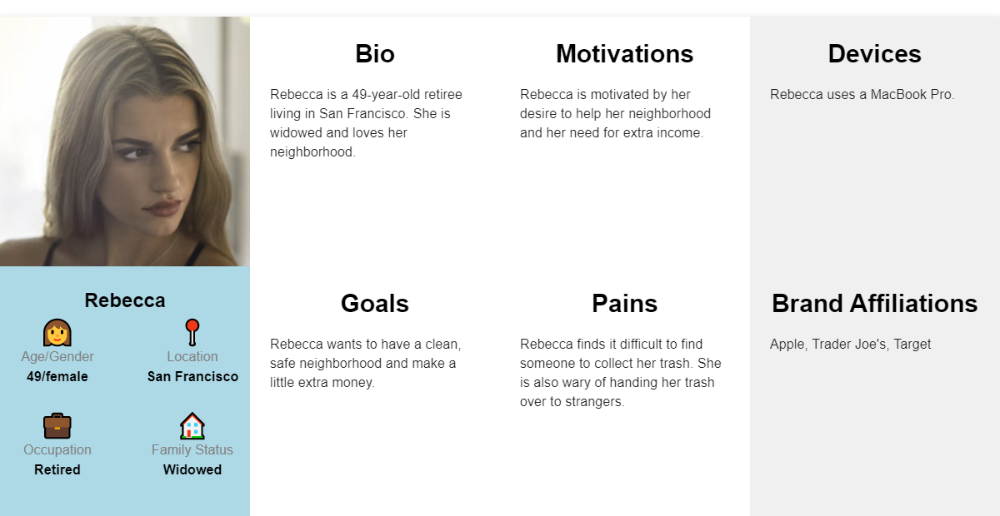
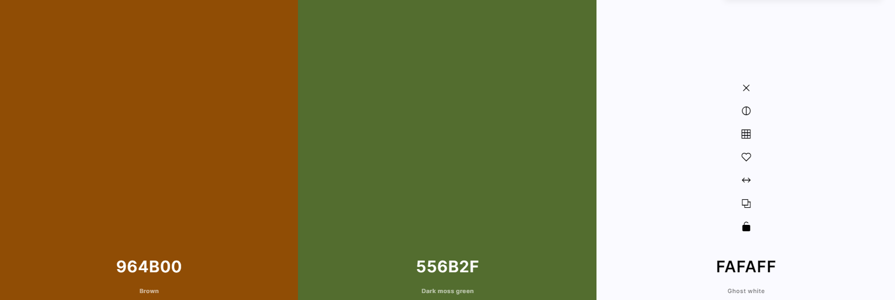

# ATRASH

**ATRASH**  website is developed using Django Framework as part of Portfolio Project 3 for my Full Stack Software Development Bootcamp at WAES useing Code Institute.

The target audience for the website would be businesses or individuals who are interested in buying recycled materials. The website could provide information about the types of materials that are available for purchase, pricing, and delivery options. The target audience could include manufacturers, construction companies, and individuals who are interested in using recycled materials for DIY projects and institutions.

You can view the live site here: >>>>>>>>>>>>>>

![mockup]

## [Content](#content)
- [ATRASH - Introduction](#ATRASH---introduction)
  - [User Experience - UX](#user-experience---ux)
    - [Site Aims](#site-aims)
    - [Agile Methodology](#agile-methodology)
      - [User Stories](#user-stories)
      - [Tasks](#tasks)
  - [Design](#design)
    - [Colours](#colours)
    - [Typography](#typography)
    - [Imagery](#imagery)
    - [Wireframes](#wireframes)
  - [Database Diagram](#database-diagram)
  - [Features](#features)
    - [Home Page](#home-page)
      - [Navbar](#navbar)
      - [Hero Image](#hero-image)
      - [Destination Section](#destination-section)
      - [Footer](#footer)
    - [User Page](#user-page)
    - [About Page](#about-page)
    - [Blog Page](#blog-page)
      - [Blog Details](#blog-details)
      - [Blog Comments](#blog-comments)
    - [Register](#register)
    - [Login](#login)
    - [Logout](#logout)
    - [Destinations](#destinations)
    - [Search Button](#search-button)
    - [Alert Messages](#alert-messages)      
  - [Admin Panel/Superuser](#admin-panelsuperuser)
  - [Technologies Used](#technologies-used)
    - [Languages Used](#languages-used)
    - [Django Packages](#django-packages)
    - [Frameworks - Libraries - Programs Used](#frameworks---libraries---programs-used)
  - [Testing](#testing)
      - [Validation](#validation)
      - [Manual Testing](#manual-testing)
  - [Bugs](#bugs)
      - [Fixed Bugs](#fixed-bugs)
      - [Unfix Bugs](#unfix-bugs)
  - [Deployment](#deployment)
      - [Creating the Django project](#creating-the-django-project)
      - [Creating Heroku app](#creating-heroku-app)
      - [Set up Environment Variables](#set-up-environment-variables)
      - [Heroku deployment](#heroku-deployment)
      - [Final Deployment](#final-deployment)
  - [Credits](#credits)
    - [Content](#content)
    - [Information Sources / Resources](#information-sources--resources)
  - [Acknowledgement](#acknowledgement)

  # User Experience - UX

## Site Aims
* Provide a convenient and affordable service for individuals and businesses to have their trash collected and disposed of responsibly.
* Reduce the amount of waste that ends up in landfills or pollutes the environment by recycling and repurposing collected materials.
* Educate the public about the importance of responsible waste management and the environmental impact of their consumption habits.
* Promote a circular economy by creating new products and materials from recycled waste, thereby reducing the need for virgin resources.
* Partner with local organizations and businesses to support sustainable development and community-building initiatives.

## Agile Methodology
The Agile Methodology was used to plan this project. This was implemented through Trello and the Project Board. Through the use of the Kanban board, the project was divided into a few different sections:

* Doing
* Code Review
* Testing
* Done

Please find my Kanban Board made with Trello  [here](https://trello.com/b/x9zPyGwh/kanban-template).

## User Personas generated on [userpersona.dev](https://userpersona.dev/):
* 
* .png)
* .png)
* .png)
* .png)
* .png)
* .png)

## Tasks

The tasks for the website development process was closely followed as mentioned in Legion Script 'Building a Food Delivery App' walkthrough project. The task is about the developers step by step, preparing the app.
The tasks that I have followed during the development phase were carried out in this order.

**Before Project Inception**

- Create Repository in GitHub
- Use CI template 
- Create Project, User Stories and prepare Kanban Board

**Creation of Project in GitPod**

- Create the django project. Check details in [deployment-section](#deployment)
- Deploying app to Ngruk - Details in [deployment](#deployment) section
- Create Database Models
	- Set up models.py file in directory
- Build Admin site
- Set up Templates
	- Create base.html - Navbar and Footer content, which gets extended to all the other template files
	- Add responsiveness to navigation and footer
    - Create index.html, view and style
	- Set up template file features with views.py and urls.py
  - about.html (Description about Trash)
  - order_confirmation.html (to confirm order and pay)
  - menu.html (to search an item)
  - order_pay_confirmation.html (to confirm the payment) 
- Install Allauth for sign in, sign up and sign out templates with-  pip3 install django-allauth 
	- Install crispy-forms to add styles to Django account templates with-  pip3 install crispy-bootstrap4
- Intensive Manual Testing and Validation checks of each page and codes written
- Final Deployment steps

-----

[Back to top](#content)

## Design

### Colours

The colour scheme has considered based on easy accessibility for all and have been consistently maintained throughout the website. The colours were chose using [Coolors](https://coolors.co/). 

### Imagery

All the imagery is related to the trash and website design. Images are static and took from google images. The imagery was uploaded by the author to the database.

### Wireframes

The wireframes for this projected were generated using [Figma](https://www.figma.com/?fuid=). 
- 
- 
- 

----

## Database Diagram

ERDPlus was used to create a database schema to visualise the types of custom models the project requires. This schema was used as a guide to what needed to be added to each model. Below is the Database structure that this project is based on.

[Back to top ⇧](#content)

# Features

## Home Page

At the very first glimpse, user can see a Navigation bar. Homepage provides the user with some quick information about the site and make use of all its features. User do not need to be registered to order. The responsive navigation bar is featured on all pages. 

.png)

----

## Navbar

- The navigation bar is present at the top of every page and navigates all links to the respective pages.
- The options to Register or Log in will be only for the staff once a user has logged in.
- The navbar is fully responsive.

.png)

## User Page

* This page will be only visible to logged-in user. When the user logs-in in the in the login page, the user navigates to the User page. On this user page, the user can view the orders, the custumer deatails, if they paid list and mark as delivered any of the orders.

 

* When user clicks on the order, following form will be displayed.

## Footer

- On the website footer, users can see basic information such as my social media, copyright, and a quote about Incredible India.

----

## About Page

- The About Page gives, users information about the Incredible India with a brief discription of india and the travel options to reach there.

----

